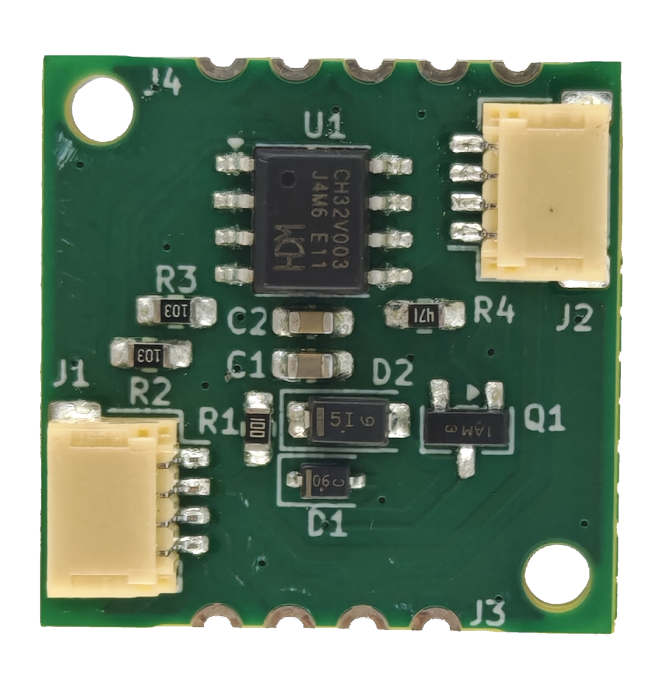
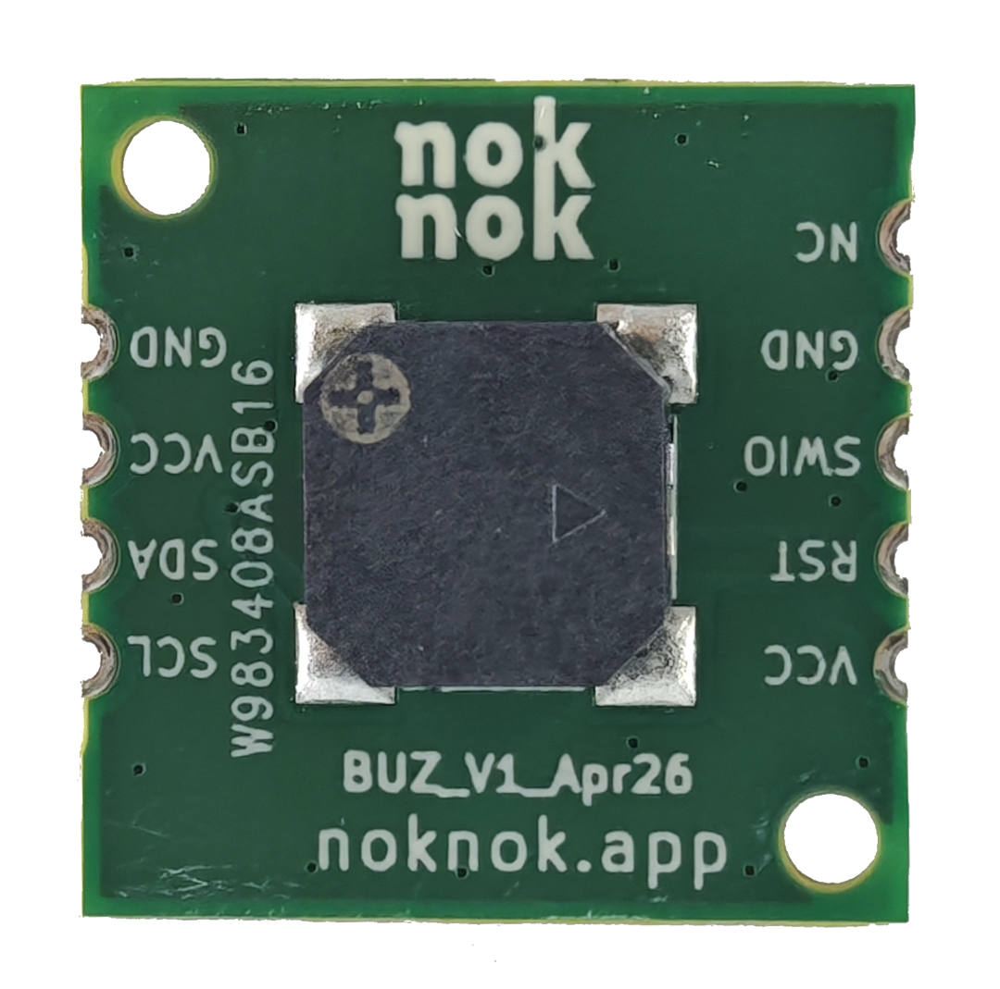

# noknok Buzzer

A compact I²C‑controlled buzzer module for the noknok ecosystem.  
Designed for audio feedback, alerts, melodies, and UI interaction in modular builds.




> **Visual concept:** see [`docs/noknok-buzzer-concept.md`](docs/noknok-buzzer-concept.md) for the protocol and architecture diagram (Markdown + SVG, renders right here on GitHub). A styled interactive version is in [`docs/noknok-buzzer-concept.html`](docs/noknok-buzzer-concept.html) (open in a browser).

---

## Overview

The Buzzer Module uses a **CH32V003J4M6** microcontroller to drive an **MLT‑8530** magnetic buzzer via PWM through an MMBT3904 NPN transistor. It connects to the Raspberry Pi Pico (Conductor) over the standard noknok **JST SH 4‑pin I²C connector**.

The Conductor sends a short command — a frequency, duration, and volume, or just a tune ID — and the module handles everything else independently. The Pico is free to do other things while the buzzer plays.

---

## Features

- Dynamic I²C address via noknok enumeration protocol (no hardcoded address)
- CH32V003J4M6 microcontroller (RISC‑V, 48 MHz, 16 KB flash)
- Drives MLT‑8530 magnetic buzzer via PWM
- **Fire and forget** — all timing is handled on‑module
- **Volume control** (0–100%, maps to PWM duty cycle)
- **5 preloaded tunes** stored in flash (Nokia, Happy Birthday, Beep OK/Error, Startup Chime)
- Immediate interrupt — any new command stops whatever is playing
- 3.3V operation via noknok I²C connector
- Compact 20×20 mm PCB

---

## How It Works

```
Your Python code (Pico)          JST SH 4-pin           Buzzer Module (CH32V003)
────────────────────────         ────────────           ────────────────────────
                                  GND ────────
buzzer.play(440, 2.0)  ──────►   3.3V ───────  ──────►  receives 5 bytes
                                  SDA ─ data ─          sets PWM to 440 Hz
                                  SCL ─ clk  ─          starts 2s countdown
                                                         ← ACK (Pico moves on)
                                                         ... 2 seconds pass ...
                                                         timer fires → silence
```

The Pico sends **3–5 bytes** and returns immediately. The CH32V003 handles all timing internally using a hardware timer. No blocking, no waiting.

---

## I²C Protocol

**I²C address:** assigned dynamically at boot — see [Enumeration](#enumeration).

### Commands (Pico → Buzzer)

| Bytes | Command | Description |
|-------|---------|-------------|
| `0x00` | **STOP** | Silence immediately |
| `0x01` `fH` `fL` `dur` `vol` | **PLAY NOTE** | Play a tone |
| `0x02` `id` | **PLAY TUNE** | Play a preloaded tune |
| `0xB0` | **ENTER BOOTLOADER** | Reset into the I²C bootloader for an over‑the‑wire firmware update (see [Firmware](#firmware)) |
| `0xB1` | **GET VERSION** | Standard noknok command — the next read returns 4 version bytes (see below) |

**PLAY NOTE fields:**

| Field | Size | Description |
|-------|------|-------------|
| `fH` + `fL` | 2 bytes | Frequency in Hz, big‑endian (e.g. 440 Hz = `0x01 0xB8`) |
| `dur` | 1 byte | Duration in 100 ms units (1 = 100 ms, 10 = 1 s, 0 = play forever) |
| `vol` | 1 byte | Volume 0–100 |

### Status read (Pico ← Buzzer)

Read 1 byte from the module address:

| Value | Meaning |
|-------|---------|
| `0x01` | Currently playing |
| `0x00` | Idle |

### Version read (Pico ← Buzzer)

`GET_VERSION` (`0xB1`) is a **noknok ecosystem-standard** command (the `0xB0`–`0xBF` range is reserved for standard commands across every module). Write `0xB1`, then read **4 bytes**:

| Byte | Field | Meaning |
|------|-------|---------|
| 0 | `PROTOCOL_VERSION` | noknok protocol/API version the module speaks (`0x01`) |
| 1 | `FW_MAJOR` | Firmware major (`3`) |
| 2 | `FW_MINOR` | Firmware minor (`3`) |
| 3 | `FW_PATCH` | Firmware patch (`0`) |

Lets the Conductor compare the installed version against the version required by the product manifest. **→ Full spec:** [Ecosystem / software / readme.md §5](https://github.com/buildwithnoknok/Ecosystem/blob/main/software/readme.md#5-standard-system-commands)

---

## Preloaded Tunes

Tunes are stored as `const` arrays in the CH32V003's flash memory. Zero RAM cost.

| ID | Name | Notes |
|----|------|-------|
| `0x01` | Nokia Tune | 13 notes |
| `0x02` | Happy Birthday | 28 notes |
| `0x03` | Beep OK | Rising double beep |
| `0x04` | Beep Error | Low double buzz |
| `0x05` | Startup Chime | Rising 4‑note arpeggio (plays on every boot) |

---

## Enumeration

The module uses the standard noknok dynamic enumeration protocol — no hardcoded I²C address. At boot it plays the startup chime while counting a UID-derived backoff delay, then joins the bus at `0x7F` for address assignment by the Conductor.

**→ Full protocol spec:** [Ecosystem / software / enumeration.md](https://github.com/buildwithnoknok/Ecosystem/blob/main/software/enumeration.md)

---

## Python API

Use the `noknok.py` library from the [Ecosystem repo](https://github.com/buildwithnoknok/brain-Pico/tree/main/software) on the Pico.

```python
from noknok import Conductor

c = Conductor()        # GP8 = SDA, GP9 = SCL
c.enumerate()          # discover all modules (takes ~3 s)

# Single note — fire and forget
c.buzzer[0].play(440, 2000)             # 440 Hz for 2 seconds
c.buzzer[0].play(440, 1000, volume=50)  # half volume

# Predefined tune — fire and forget
c.buzzer[0].tune(c.buzzer[0].NOKIA)
c.buzzer[0].tune(c.buzzer[0].HAPPY_BIRTHDAY)
c.buzzer[0].tune(c.buzzer[0].BEEP_OK)

# Note in a melody — plays and waits
c.buzzer[0].note(440, 500)   # plays 440 Hz for 500 ms, then returns

# Stop
c.buzzer[0].stop()

# Status
c.buzzer[0].is_playing()     # True or False
c.buzzer[0].wait()           # block until idle

# Multiple buzzers
c.buzzer[1].play(880, 500)   # second buzzer (if present)
```

---

## Files on the Pico

These are **Conductor-level files shared by every module** - not buzzer-specific:

| File | Purpose |
|------|---------|
| `noknok.py` | noknok Conductor library - master copy in [brain-Pico/software](https://github.com/buildwithnoknok/brain-Pico/tree/main/software) |
| `noknok_state.json` | Module address persistence, auto-created by `enumerate()` - see [enumeration.md](https://github.com/buildwithnoknok/Ecosystem/blob/main/software/enumeration.md) |
| `noknok_roles.json` | Role -> UID mapping - see [roles.md](https://github.com/buildwithnoknok/Ecosystem/blob/main/software/roles.md) |

> **Filesystem write access required.** See the [CircuitPython filesystem docs](https://docs.circuitpython.org/en/latest/docs/library/storage.html).

---

## Hardware

| Spec | Value |
|------|-------|
| PCB size | 20 × 20 mm |
| MCU | CH32V003J4M6 (SOP‑8, RISC‑V, 48 MHz) |
| Buzzer | MLT‑8530 (magnetic, 3.3V) |
| Driver | MMBT3904 NPN transistor |
| Connector | JST SH 4‑pin (Qwiic / Stemma QT compatible) |
| Supply voltage | 3.3V via I²C connector |
| PWM pin | PA1 (TIM1 CH2) |
| I²C SDA | PC1 |
| I²C SCL | PC2 |
| Flash header | J4 — 5‑pin (GND, SWIO, RST, VCC) |

> **Known hardware note:** Remove the 10Ω series resistor on VDD (R1). It causes a brownout reset when the buzzer fires at high volume.

---

## Firmware

**v3.3 runs under the shared noknok I²C bootloader** ([module-I2C-bootloader](https://github.com/buildwithnoknok/module-I2C-bootloader)) — the module can be re‑flashed **over the I²C bus** (no SWDIO cable in the field). The application is linked at the `0x1000` offset (`app.ld`) above the 4 KB bootloader and reserves the top 16 B of RAM for the bootloader handoff cell. Command `0xB0` drops the running module into the bootloader for an update.

```bash
cd firmware/src
make build   # compile the offset-linked application -> buzzer_firmware.bin
```

Flashing: normally over I²C from the Pico (`module_flasher.py` in `brain-Pico`). A blank board needs the bootloader SWD‑flashed once first. SWD remains the unbrickable backstop — see *Recovery & SWD flashing* in the [bootloader README](https://github.com/buildwithnoknok/module-I2C-bootloader#recovery--swd-flashing). `make flash` here still does a one‑off SWD flash of the app for bench bring‑up.

> ch32fun must be installed at `../ch32fun/` relative to `firmware/src/` — see [cnlohr/ch32v003fun](https://github.com/cnlohr/ch32v003fun) for setup instructions.

| Metric | Value |
|--------|-------|
| Firmware version | v3.3 (bootloader‑hosted) |
| Application size | 2928 B of 11 KB app region (26%) |
| RAM used | 76 B of ~2 KB (4%) |

### Files

| File | Description |
|------|-------------|
| `firmware/src/buzzer_firmware.c` | CH32V003 firmware source |
| `firmware/src/Makefile` | Build configuration |
| `firmware/src/funconfig.h` | ch32v003fun config |
| `firmware/src/app.ld` | Linker script (application at 0x1000, above the 4 KB bootloader) |
| `firmware/bin/buzzer_firmware.bin` | Compiled application binary |
| `docs/noknok-buzzer-concept.md` | Concept diagram - Markdown + SVG (renders on GitHub) |
| `docs/noknok-buzzer-concept.html` | Same concept as a styled interactive page (browser) |

---

## Status

| Area | Status |
|------|--------|
| Hardware | v1.0 |
| Firmware | **v3.3 — complete (bootloader‑hosted, I²C OTA)** |
| Python library | **complete** (in [Ecosystem repo](https://github.com/buildwithnoknok/brain-Pico/tree/main/software)) |
| Documentation | **complete** |

---

## License

- Firmware / code: MIT — see [LICENSE](LICENSE).
- Hardware (schematics, PCB layout, fab files): CC BY-SA 4.0 — see [LICENSE-hardware](LICENSE-hardware).

---

## Safety & Liability

noknok hardware is an electronic device and a DIY/maker kit. You assemble, modify, flash, power, and operate it at your own risk, and it is provided as is, without warranty. See the full notice: [License, Safety & Liability](https://buildwithnoknok.github.io/safety-and-license/).