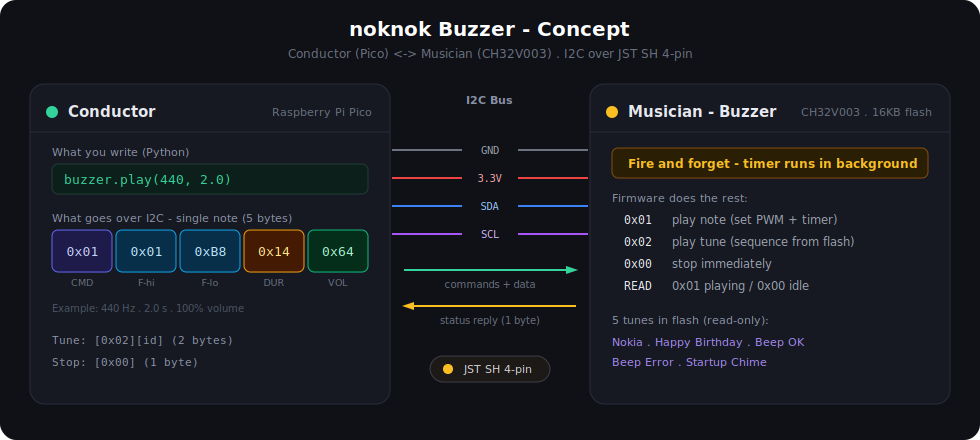

# noknok Buzzer - Module Concept

> Conductor (Pico)  <->  Musician (CH32V003)  /  I2C over JST SH 4-pin

A GitHub-readable version of the concept diagram. For the styled interactive page, open
[`noknok-buzzer-concept.html`](noknok-buzzer-concept.html) in a browser.



---

## The idea

The Conductor (Raspberry Pi Pico) sends a short command over I2C; the Musician (the
buzzer''s CH32V003) does everything else. The Pico **moves on instantly** - all timing
happens on the module.

---

## Conductor side (Pico) - what you write

```python
# Single note - fire and forget
buzzer.play(440, duration=2.0)
buzzer.play(440, duration=2.0, volume=75)

# Predefined tune - also fire and forget
buzzer.play("nokia-tune")
buzzer.play("happy-birthday")
buzzer.play("beep-ok")

# Stop at any time
buzzer.stop()
```

> This is the conceptual API. The actual library calls are `c.buzzer[0].play(440, 2000)`
> and `c.buzzer[0].tune(...)` - see the module [README](../README.md).

## What goes over I2C

**Play a single note - 5 bytes** (example: 440 Hz, 2.0 s, 100% volume):

| Byte | `0x01` | `0x01` | `0xB8` | `0x14` | `0x64` |
|------|------|------|------|------|------|
| Meaning | CMD PLAY NOTE | FREQ high | FREQ low | DUR (x100 ms) | VOL (0-100) |

**Play a predefined tune - 2 bytes** (example: "nokia-tune", ID `0x01`):

| Byte | `0x02` | `0x01` |
|------|------|------|
| Meaning | CMD PLAY TUNE | TUNE ID |

**Stop - 1 byte:**

| Byte | `0x00` |
|------|------|
| Meaning | CMD STOP (immediate, whatever is playing) |

## The I2C bus (JST SH 4-pin)

| Wire | Purpose |
|------|---------|
| GND | Ground |
| 3.3V | Power |
| SDA | Data |
| SCL | Clock |

- Pico to buzzer: commands and data
- Buzzer to Pico: status reply (1 byte) - `0x01` = playing, `0x00` = idle

---

## Musician side (CH32V003) - what the firmware does

| Command | Action |
|---------|--------|
| `0x00` STOP | Stop PWM immediately, clear the busy flag. |
| `0x01` PLAY NOTE | Read freq (2 bytes), duration, volume; set the PWM prescaler and duty cycle; start the timer; return to I2C immediately - the timer runs in the background. |
| `0x02` PLAY TUNE | Read the tune ID; look up the note sequence in flash; play each note then silence; return to I2C immediately - the tune runs in the background. |
| READ | Reply with 1 byte: `0x01` = playing, `0x00` = idle. |

### Tune library - stored in CH32V003 flash (read-only)

| ID | Tune | Notes |
|----|------|-------|
| `0x01` | Nokia Tune | 13 notes |
| `0x02` | Happy Birthday | 25 notes |
| `0x03` | Beep - OK | 2 notes |
| `0x04` | Beep - Error | 2 notes |
| `0x05` | Startup Chime | 4 notes |
| `0x06+` | Reserved for future tunes | - |

Each tune is an array of `{freq, duration_ms}` pairs, stored as `const` in C and compiled
into flash. Zero RAM cost.

---

## Why it is designed this way

**Why fire and forget?** The Pico sends a command and moves on instantly. The CH32V003
handles all timing with its hardware timer, so the Pico never has to wait or count
milliseconds - it is free to do other things while the buzzer plays.

**Why tunes on the CH32V003?** Tunes are always available, no matter what app is on the
Pico. The Pico sends 2 bytes; the CH32V003 knows the rest. Adding a tune means updating
the buzzer firmware, independent of any Pico app.

**Memory usage.** The CH32V003 has 16 KB flash. A 25-note tune costs ~100 bytes; ten
tunes ~1 KB; firmware logic ~3-4 KB - plenty of room for the register header and the
[I2C OTA bootloader](https://github.com/buildwithnoknok/module-I2C-bootloader) too.